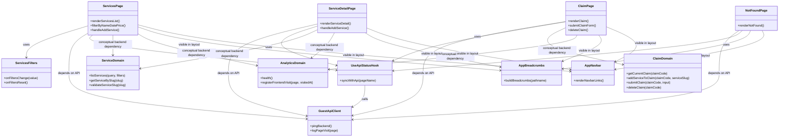

# Диаграмма классов (Lab 5)

```mermaid
classDiagram

class ServiceDomain {
  +listServices(query, filters)
  +getServiceBySlug(slug)
  +validateServiceSlug(slug)
}

class ClaimDomain {
  +getCurrentClaim(claimCode)
  +addServiceToClaim(claimCode, serviceSlug)
  +submitClaim(claimCode, input)
  +deleteClaim(claimCode)
}

class AnalyticsDomain {
  +health()
  +registerFrontendVisit(page, visitedAt)
}

class ServicesPage {
  +renderServicesList()
  +filterByNameDatePrice()
  +handleAddService()
}

class ServiceDetailPage {
  +renderServiceDetail()
  +handleAddService()
}

class ClaimPage {
  +renderClaim()
  +submitClaimForm()
  +deleteClaim()
}

class NotFoundPage {
  +renderNotFound()
}

class AppBreadcrumbs {
  +buildBreadcrumbs(pathname)
}

class AppNavbar {
  +renderNavbarLinks()
}

class ServicesFilters {
  +onFiltersChange(value)
  +onFiltersReset()
}

class GuestApiClient {
  +pingBackend()
  +logPageVisit(page)
}

class UseApiStatusHook {
  +syncWithApi(pageName)
}

ServicesPage --> ServicesFilters : uses
ServicesPage --> GuestApiClient : depends on API
ServiceDetailPage --> GuestApiClient : depends on API
ClaimPage --> GuestApiClient : depends on API
NotFoundPage --> GuestApiClient : depends on API

UseApiStatusHook --> GuestApiClient : calls
ServicesPage --> UseApiStatusHook : uses
ServiceDetailPage --> UseApiStatusHook : uses
ClaimPage --> UseApiStatusHook : uses
NotFoundPage --> UseApiStatusHook : uses

ServicesPage --> ServiceDomain : conceptual backend dependency
ServiceDetailPage --> ServiceDomain : conceptual backend dependency
ClaimPage --> ClaimDomain : conceptual backend dependency
ServicesPage --> AnalyticsDomain : conceptual backend dependency
ServiceDetailPage --> AnalyticsDomain : conceptual backend dependency
ClaimPage --> AnalyticsDomain : conceptual backend dependency

ServicesPage --> AppBreadcrumbs : visible in layout
ServiceDetailPage --> AppBreadcrumbs : visible in layout
ClaimPage --> AppBreadcrumbs : visible in layout
NotFoundPage --> AppBreadcrumbs : visible in layout

ServicesPage --> AppNavbar : visible in layout
ServiceDetailPage --> AppNavbar : visible in layout
ClaimPage --> AppNavbar : visible in layout
NotFoundPage --> AppNavbar : visible in layout
```
